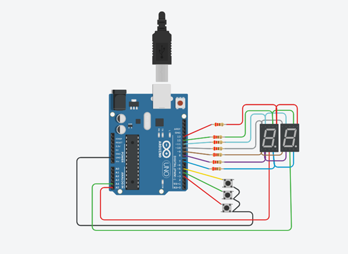
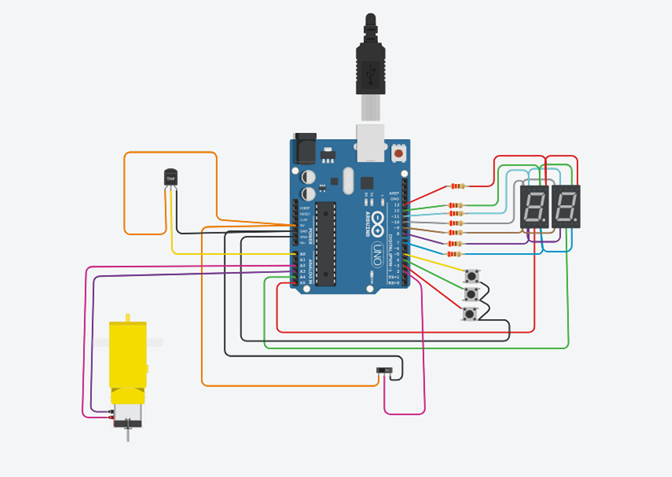
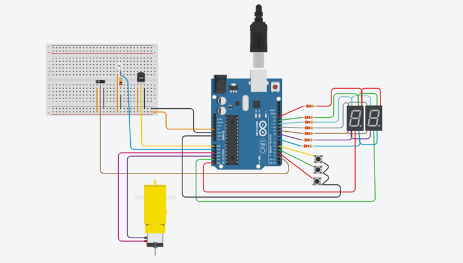
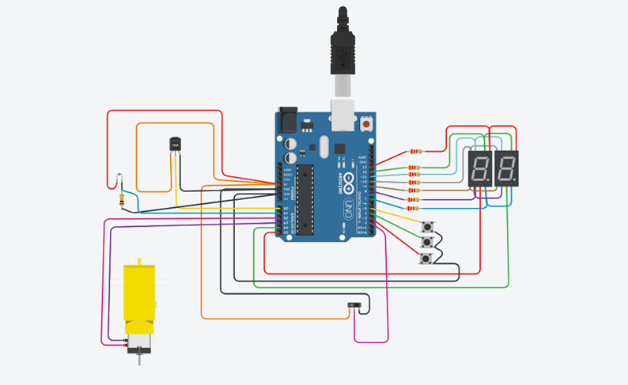

# Parcial-spd
#Alumno: Joaquin Felipe Diaz

#Proyecto Parte 1:

#Funcion del proyecto:
El proyecto muestra en dos displays de 7 segmentos que estan multiplexados, un contador de 00 a 99. El contador se va modificando a traves de un boton de suma, otro
de resta y uno de rerseteo.

#Funciones que contiene el proyecto:

Keypressed:
Esta funcion nos permite saber el estado de los botones. Los 3 botones son de tipo INPUT_PULLUP por lo cual siempre estan en estado "1" o "HIGH" al menos que se presione el
boton. Si el boton al ser presionado cambia a 0 se modifican las variables sube, subePrevia, resta, restaPrevia, reset y resetPrevia, con el fin de que el contador se modifique por cada vez que se presiona el boton.
~~~ C 
int keypressed (void){
 sube = digitalRead(SUBE);
 baja = digitalRead(BAJA);
 reset = digitalRead(RESET);
   if (sube==1)
     subePrevia = 1;
   if (baja==1)
     bajaPrevia =1;
   if (reset==1)
     resetPrevia = 1;   
   	   if (sube == 0 && sube != subePrevia)
        {
         subePrevia = sube;
         return SUBE;
   	     }
       if (baja == 0 && baja != bajaPrevia)
        {
         bajaPrevia = baja;
         return BAJA;
         }
        if (reset == 0 && reset != resetPrevia)
         {
          resetPrevia = reset;
          return RESET;
          }
   return 0;
 }
~~~

printCount:
Indica los valores que se deben imprimir en los displays segun corresponda. Se realizan segun el display determinadas operaciones matematicas con el numero obtenido por 
parametro para asi obtener el numero correcto en el display indicado.
~~~ C 
void printCount(int count){
 prendeDigito(APAGADOS);
 printDigit(count/10);
 prendeDigito(DECENA);
 prendeDigito(APAGADOS);
 printDigit(count - 10*((int)count/10));
 prendeDigito(UNIDAD);
}
~~~
prendeDigito:
Enciende el display correspondiente segun el tipo de digito que obtenemos por parametro. Cabe aclarar que se utiliza un delay de un muy corto periodo(delay(timeDisplayOn)) para que el cambio de leds que se apagan y encienden se imperceptible a los ojos del ser humano.
~~~ C
void prendeDigito(int digito){
  if (digito == UNIDAD){
  digitalWrite(UNIDAD, LOW);//Enciende
  digitalWrite(DECENA, HIGH);//Apaga
  delay(timeDisplayOn);
  }
  else if(digito == DECENA){
  digitalWrite(UNIDAD, HIGH);//Apaga
  digitalWrite(DECENA, LOW);//Enciende
  delay(timeDisplayOn);
  }else{
  digitalWrite(UNIDAD, HIGH);//Apaga
  digitalWrite(DECENA, HIGH);//Apaga
  delay(timeDisplayOn);
  }
}
~~~
printDigit:
Segun el digito recibido por parametro se enciende determinado led para cada caso.
~~~ C
void printDigit(int digit){ 
  digitalWrite(A, LOW);
  digitalWrite(B, LOW);
  digitalWrite(C, LOW);
  digitalWrite(D, LOW);
  digitalWrite(E, LOW);
  digitalWrite(F, LOW);
  digitalWrite(G, LOW);
    switch (digit) {
    case 1:                 //escribe en el 7seg el numero 1
      prender_uno();
     break;
    case 2:                //escribe en el 7seg el numero 2
      prender_dos();
     break;      
    case 3:               //escribe en el 7seg el numero 3
       prender_tres();
      break;
    case 4:               //escribe en el 7seg el numero 4
      prender_cuatro();
     break;
    case 5:               //escribe en el 7seg el numero 5
      prender_cinco();
     break;
    case 6:               //escribe en el 7seg el numero 6
      prender_seis();
     break;
    case 7:              //escribe en el 7seg el numero 7
      prender_siete();
     break;
    case 8:              //escribe en el 7seg el numero 8
      prender_ocho();
      break;
    case 9:               //escribe en el 7seg el numero 9
      prender_nueve();
     break;
    case 0:                //escribe en el 7seg el numero 0
       prender_cero();
      break;
        
       
      
    }
}
~~~
## :robot: Link al proyecto
https://www.tinkercad.com/things/keQHU63HTtI-ejercicio-parcial-parte-1-joaquin-felipe-diaz-1b/editel?sharecode=aj32nEVRsZ7xWgFOk9Aydu_KI2w31uWBayBlaLfo2KQ

#Proyecto Parte 2

#Funcion del proyecto
El proyecto contiene dos contadores, uno de 00 a 99 y otro de numeros primos entre el 00 y 99. Estos son activados a traves de un interruptor deslizante. Luego tambien contiene un medidor de temperatura y un motor. El motor dependiendo de si sube o baja el contador gira para adelante o hacia atras, si el sensor de temperatura supera los 100 grados el motor se apaga o si se presiona el boton de reset.

#Funciones que contiene el proyecto:
apagar_motor:
Si ambos pines entran en estado 0 el motor deja de recibir energia y se apaga. Tambien el contador se resetea.
~~~ C
void apagar_motor(){
digitalWrite(A3,0);//Se apaga el motor.
digitalWrite(A2,0);
countDigit=0;//El display se queda en 0
}
~~~
motor_hacia_adelante:
El pin A2 recibe energia para que el motor gire hacia adelante, mientras que el pin A3 no recibe energia.
~~~ C
//Gira el motor hacia adelante.
void motor_hacia_adelante(){
digitalWrite(A2,1);
digitalWrite(A3,0);
}
~~~
motor_hacia_atras:
El pin A3 recibe energia para que el motor gire hacia atras, mientras que el pin A2 no recibe energia.
~~~ C
//Gira el motor hacia atras.
void motor_hacia_atras(){
digitalWrite(A3,1);//El motor gira hacia atras.
digitalWrite(A2,0);
}
~~~
 Contadores:
 Si el boton deslizante esta en estado = 0 se activa el contador de 00 a 99.  Si el boton deslizante esta en estado = 1 se activa el contador de numeros primos.
Utilizamos (int botonDeslizante = digitalRead(Deslizador);) para poder leer el boton tipo switch y almacenarle un estado de tipo entero.
~~~ C
///CONTADOR 00 A 99.
  if(botonDeslizante== 0){
  int pressed = keypressed();
  if (pressed==SUBE){
    motor_hacia_adelante();
    countDigit++; 
    if (countDigit >99)
      countDigit =0;   
  }else if(pressed ==BAJA){//Si se presiona el boton de bajar:
  countDigit--;//El digito se le resta 1 al presionar el boton.
    motor_hacia_atras();
    if (countDigit <0)
      countDigit =99;
  }
  else if(pressed == RESET){
    apagar_motor();//Apaga el motor y restablece el display a 0. 
  }
 printCount(countDigit);
  }
  //TERMINA CONTADOR 00 A 99.
  
  //CONTADOR NUMEROS PRIMOS HASTA 99.
 if(botonDeslizante == 1){
   int pressed = keypressed();
  if (pressed==SUBE){
    countDigit++;
    motor_hacia_adelante();     
    if (countDigit >99)
      countDigit =0;   
  }else if(pressed ==BAJA){//Si se presiona el boton de bajar:
  countDigit--;//El digito se le resta 1 al presionar el boton.
  motor_hacia_atras();
    if (countDigit <0)
      countDigit =99;
  }
  else if(pressed == RESET){
    apagar_motor();//Apaga el motor y restablece el display a 0. 
  }
  for (i = 1; i <= 99; i++)
    if (countDigit % i == 0 &&  countDigit >=2){//comparamos el valor de display con todos los numeros del 00 al 99
    contador_divisibles= contador_divisibles + 1;
    if(contador_divisibles == 2){// si se divide solo por 1 y por si mismo
      print_primo = true;// es primo          
  }
    else{
    print_primo = false;// sino no es primo
    
    }
  }
   if(print_primo == true){//Si el numero es primo
     contador_divisibles =0; //reestablecemos el contador
     printCount(countDigit);//imprimimos en el display el valor
   }else{
     contador_divisibles = 0;
   printCount(0);//si no es primo imprime 0
   }
}
~~~
Temperatura:
Utilizamos el metodo map para hacer las equivalencias y poder obtener los grados. Luego si la temperatura supera los 100 grados el motor se apaga y el contador se estanca en 0.
~~~ C
lectura = analogRead(SENSOR);//Lee el sensor
  grados=map(lectura,20,350,-40,125);
  if (grados >100){  //Si los grados superan el 100
  apagar_motor();
  }
~~~
## :robot: Link al proyecto
https://www.tinkercad.com/things/j7c0aOjP5hI-copy-of-ejercicio-parcial-parte-2-joaquin-felipe-diaz-1b/editel?sharecode=vGhnIhnScdqPF_YzJPGsI2PgPvk-cZ1CiEmUkKabBHg

#Proyecto Parte 3:

#Funcion del proyecto:
Contiene un sensor de luz ambietal el cual si supera el 50% del nivel de luz total apaga el motor.

~~~ C
int sensor_luz =A1;
int valor_de_luz;
pinMode(sensor_luz, INPUT);//Esrablecemos el pin como entrada
//SENSOR DE LUZ MEDIAMBIENTAL
  int valor_de_luz = analogRead(sensor_luz);
  luz = valor_de_luz * 0.0976;//Convertimos el valor en porcentaje
  
  if (luz > 50){//Si el sensor de luz supera el 50 porciento 
  apagar_motor();//se apaga el motor
  }
~~~
## :robot: Link al proyecto
https://www.tinkercad.com/things/cg6Gpqwhk6p-copy-of-ejercicio-parcial-parte-3-joaquin-felipe-diaz-1b/editel?sharecode=Jvbqy_SVM-zl7UaXyVOWA2JLdC8DOP1p04tR-TWt7Ek

#Proyecto Parte 4:

#Funcion del proyecto:
Contiene un contador de numeros multiplos de 5 que es mostrado a traves de dos displays de 7 segmentos multiplexados.

Explicación de codigo:
Tomamos el valor de la cuenta a traves de la variable countDigit la cual es modificada mediante los pulsadores. Si el numero de countDigit al dividirlo por 5 nos da de resto 0 siginifica que es multiplo de 5, al cumplirse la condicion imprimimos el valor por los displays de 7 segmentos.Si no se cumple la condicion se imprime un 0.
~~~ C
if (countDigit % 5 == 0){
   printCount(countDigit);
   }
   if (countDigit % 5 !=0){
   printCount(0);
   }
~~~ 